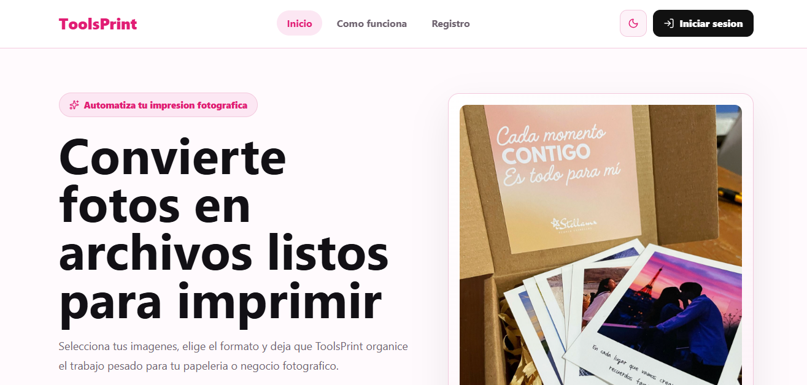
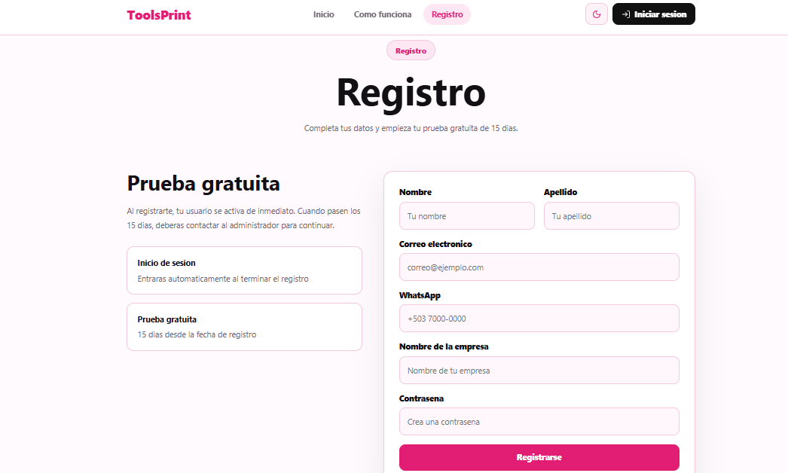
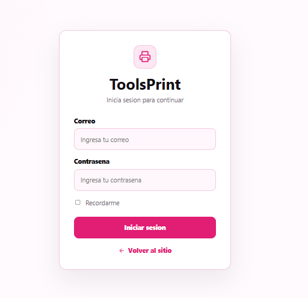
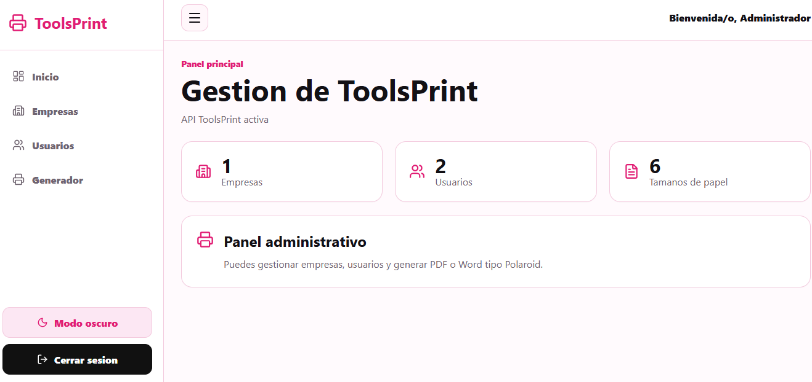
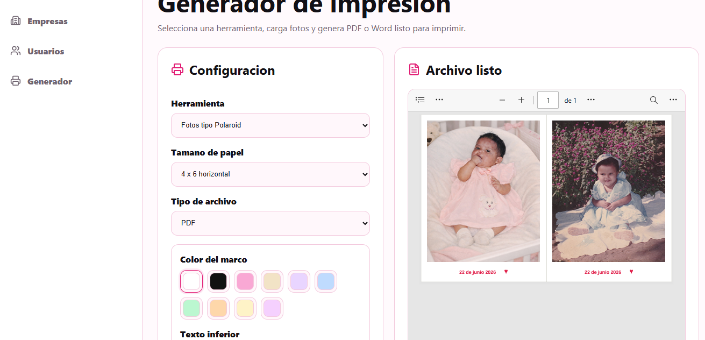
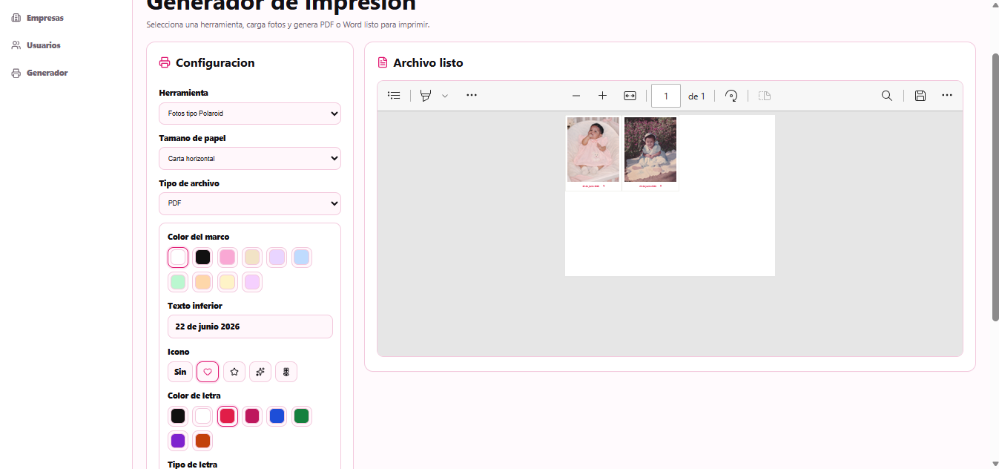

# Capturas del Sistema

## Página Principal

Vista principal del sistema donde los usuarios pueden conocer las funcionalidades de ToolsPrint, los beneficios de la automatización de impresiones fotográficas y acceder al registro o inicio de sesión.



---

## Registro de Usuarios

Formulario de registro para nuevos usuarios. Las solicitudes son enviadas al sistema para su posterior revisión y aprobación por parte del administrador.



---

## Inicio de Sesión

Pantalla de acceso para usuarios previamente aprobados y asociados a una empresa dentro de la plataforma.



---

## Vista Previa de Impresión

Permite visualizar el resultado final antes de generar el documento, asegurando que las fotografías se encuentren correctamente organizadas y listas para imprimir.



---

## Personalización de Polaroids

Herramienta para personalizar las fotografías agregando colores al marco, frases, fechas e iconos decorativos antes de generar el documento final.



---

## Opciones Avanzadas de Personalización

Configuraciones adicionales para personalizar el diseño de las Polaroids y adaptar el resultado a diferentes estilos y ocasiones.



---

# Registro y Activación de Usuarios

ToolsPrint cuenta con un sistema de control de acceso mediante aprobación administrativa.

### Flujo de Registro

1. El usuario completa el formulario de registro.
2. La información es almacenada en la tabla de registros.
3. La solicitud queda en estado pendiente.
4. El administrador revisa la información proporcionada.
5. Si la solicitud es aprobada:

   * Se asigna una empresa al usuario.
   * Se crea la cuenta de acceso.
   * Se habilita el uso de las herramientas.
6. Si la solicitud es rechazada, el usuario no podrá acceder al sistema.

### Prueba Gratuita

Los nuevos usuarios disponen de una prueba gratuita de 15 días para evaluar las funcionalidades disponibles dentro de la plataforma.

### Control de Acceso

Actualmente el sistema incluye:

* Registro de solicitudes.
* Aprobación manual por parte del administrador.
* Asociación de usuarios a empresas.
* Activación e inactivación de cuentas.
* Gestión centralizada de acceso a las herramientas.

---

# Importante

Este proyecto NO incluye migraciones automáticas de base de datos.

La base de datos debe crearse manualmente ejecutando el script SQL ubicado en:

```text
backend/database/base1.sql
```

Antes de iniciar el sistema es necesario crear la base de datos y ejecutar dicho script desde MySQL Workbench o cualquier cliente MySQL compatible.
